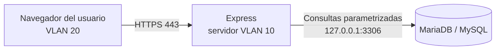
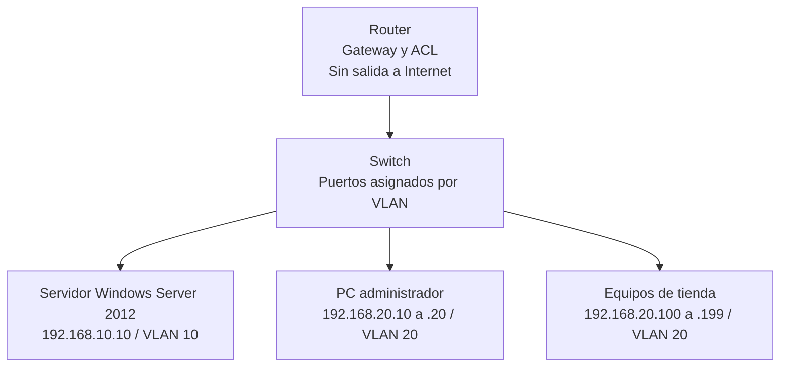
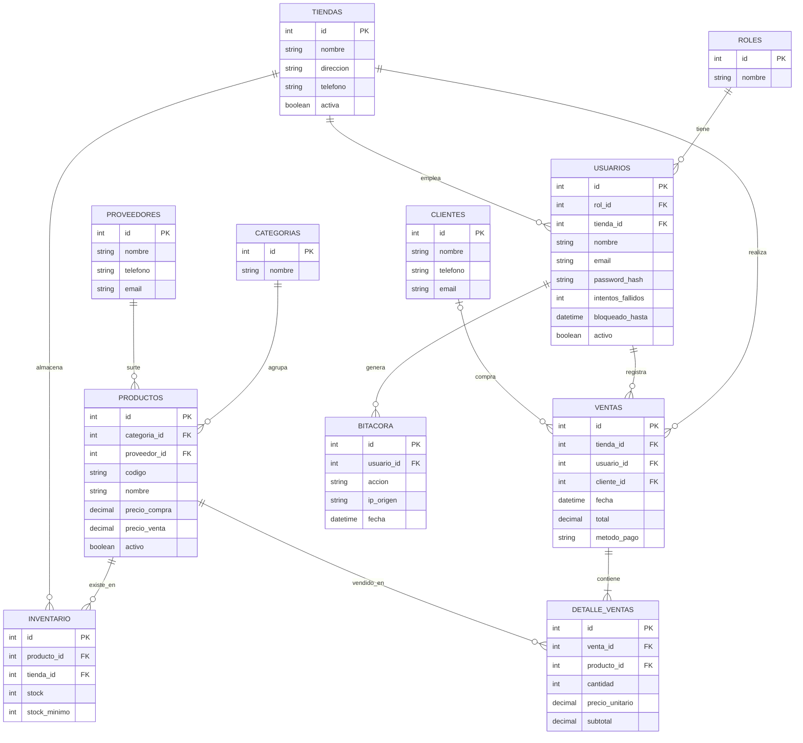

# Documentación técnica: Tiendas 4B

Este documento reúne la arquitectura, la red, la base de datos (con su diagrama y script SQL completo), la estructura del proyecto, el flujo de trabajo en equipo y las medidas de seguridad.

> Los diagramas están escritos en Mermaid. Se visualizan automáticamente en GitHub, GitLab y en VS Code (con la extensión "Markdown Preview Mermaid Support"). También se pueden pegar en https://mermaid.live para exportarlos como imagen.

## Índice

1. Resumen de la arquitectura
2. Diagrama y plan de red
3. Configuración del servidor
4. Base de datos (diagrama y script SQL)
5. Estructura del proyecto
6. Trabajo en equipo con Git
7. Seguridad (checklist)
8. Despliegue paso a paso
9. Riesgos conocidos
10. Reparto de tareas sugerido

---

## 1. Resumen de la arquitectura

| Capa | Tecnología | Dónde corre |
|---|---|---|
| Frontend | React (compilado con `npm run build`) | Servido como archivos estáticos por Express |
| Backend | Node.js + Express.js (API REST) | Servidor Windows Server 2012 |
| Base de datos | MariaDB o MySQL | Mismo servidor, escuchando solo en `127.0.0.1` |
| Red | Router + switch administrable (VLAN) | Red local sin Internet |

Flujo de una petición:



---

## 2. Diagrama y plan de red



### 2.1 Direccionamiento

| Segmento | VLAN | Red | Gateway (router) | Uso |
|---|---|---|---|---|
| Servidores | 10 | 192.168.10.0/24 | 192.168.10.1 | Solo el servidor (`192.168.10.10`, IP fija) |
| Usuarios | 20 | 192.168.20.0/24 | 192.168.20.1 | Administradores y equipos de tienda |

Rangos dentro de la VLAN 20:

| Rango | Uso |
|---|---|
| 192.168.20.2 a .9 | Reservado (impresoras, equipos de red) |
| 192.168.20.10 a .20 | Administradores |
| 192.168.20.100 a .199 | Equipos de tienda (DHCP con reserva por MAC) |
| Resto | Sin asignar; el DHCP no debe entregarlo |

### 2.2 Reglas del router (ACL)

| # | Origen | Destino | Puerto | Acción |
|---|---|---|---|---|
| 1 | 192.168.20.0/24 | 192.168.10.10 | TCP 443 | Permitir |
| 2 | 192.168.20.10-20 | 192.168.10.10 | TCP 3389 (RDP) | Permitir (solo administración) |
| 3 | 192.168.20.0/24 | 192.168.10.0/24 | Cualquiera | Denegar |
| 4 | Cualquiera | Internet | Cualquiera | Denegar |

### 2.3 Switch

- Un puerto por equipo; los puertos del servidor van en VLAN 10 y los de usuarios en VLAN 20.
- Apagar (shutdown) los puertos que no se usen.
- Activar *port security* (una MAC por puerto) si el equipo lo permite.
- Cambiar usuario y contraseña de fábrica del router y del switch.
- Si el switch **no** es administrable, usar una sola red `192.168.10.0/24` con los mismos rangos y filtrar con el firewall de Windows (sección 3.3).

---

## 3. Configuración del servidor

### 3.1 Base

- IP fija: `192.168.10.10`, máscara `255.255.255.0`, puerta de enlace `192.168.10.1`.
- Instalar todas las actualizaciones disponibles para el sistema operativo.
- Crear cuentas separadas: una de administrador (para mantenimiento) y otra de servicio con permisos mínimos para ejecutar la aplicación.
- Deshabilitar roles y servicios que no se usen.

### 3.2 Software

> Antes de instalar, verifiquen qué versión de Node.js y de MariaDB/MySQL admite Windows Server 2012. Las versiones más recientes ya no lo soportan; usen la última versión compatible.

1. Node.js (versión LTS compatible con el sistema).
2. MariaDB o MySQL (versión compatible).
3. NSSM o PM2 para ejecutar Express como servicio.
4. Git (para obtener el código).

En la configuración de la base de datos (`my.ini`) dejar:

```ini
bind-address = 127.0.0.1
```

### 3.3 Firewall de Windows (PowerShell como administrador)

```powershell
# Permitir HTTPS solo desde la VLAN de usuarios
New-NetFirewallRule -DisplayName "Tiendas4B HTTPS" -Direction Inbound -Protocol TCP `
  -LocalPort 443 -RemoteAddress 192.168.20.0/24 -Action Allow

# Permitir escritorio remoto solo desde el rango de administradores
New-NetFirewallRule -DisplayName "Tiendas4B RDP Admin" -Direction Inbound -Protocol TCP `
  -LocalPort 3389 -RemoteAddress 192.168.20.10-192.168.20.20 -Action Allow

# El puerto 3306 (base de datos) NO se abre; solo se accede desde el mismo servidor.
```

Después, deshabilitar o eliminar las reglas de entrada que no sean necesarias.

### 3.4 HTTPS

Generar un certificado autofirmado (o de una CA interna) y configurar Express para usarlo. Los equipos de usuarios deberán confiar en ese certificado.

```bash
openssl req -x509 -nodes -days 365 -newkey rsa:2048 \
  -keyout certs/tiendas4b.key -out certs/tiendas4b.crt \
  -subj "/CN=192.168.10.10"
```

La carpeta `certs/` va en `.gitignore`.

---

## 4. Base de datos

### 4.1 Diagrama entidad-relación



### 4.2 Descripción de las tablas

| Tabla | Propósito | Notas |
|---|---|---|
| `roles` | Perfiles de acceso | Administrador, Gerente, Cajero |
| `tiendas` | Sucursales | Baja lógica con `activa` |
| `usuarios` | Cuentas del sistema | `tienda_id` es NULL para administradores; guarda solo el hash de la contraseña |
| `categorias` | Clasificación de productos | |
| `proveedores` | Quién surte los productos | |
| `productos` | Catálogo general | `codigo` único |
| `inventario` | Existencias por producto y tienda | Un registro por par producto-tienda |
| `clientes` | Clientes opcionales en la venta | |
| `ventas` | Encabezado de cada venta | `cliente_id` puede ser NULL |
| `detalle_ventas` | Renglones de cada venta | Guarda el precio vigente al momento de la venta |
| `bitacora` | Auditoría | La aplicación solo puede insertar y consultar |

### 4.3 Script SQL completo (MariaDB / MySQL)

Guardar como `backend/db/schema.sql`. Ejecutar con un usuario administrador de la base de datos:

```bash
mysql -u root -p < schema.sql
```

```sql
-- =====================================================
--  Tiendas 4B - Esquema de base de datos
--  Motor: MariaDB 10.2+ / MySQL 5.7+ (CHECK requiere MariaDB 10.2+ o MySQL 8.0.16+)
-- =====================================================

CREATE DATABASE IF NOT EXISTS tiendas4b
  CHARACTER SET utf8mb4
  COLLATE utf8mb4_unicode_ci;

USE tiendas4b;

-- ---------- Catálogos base ----------

CREATE TABLE roles (
  id      INT UNSIGNED NOT NULL AUTO_INCREMENT,
  nombre  VARCHAR(30)  NOT NULL,
  PRIMARY KEY (id),
  UNIQUE KEY uq_roles_nombre (nombre)
) ENGINE=InnoDB;

CREATE TABLE tiendas (
  id         INT UNSIGNED NOT NULL AUTO_INCREMENT,
  nombre     VARCHAR(80)  NOT NULL,
  direccion  VARCHAR(150) NULL,
  telefono   VARCHAR(20)  NULL,
  activa     BOOLEAN      NOT NULL DEFAULT TRUE,
  creada_en  TIMESTAMP    NOT NULL DEFAULT CURRENT_TIMESTAMP,
  PRIMARY KEY (id),
  UNIQUE KEY uq_tiendas_nombre (nombre)
) ENGINE=InnoDB;

CREATE TABLE categorias (
  id      INT UNSIGNED NOT NULL AUTO_INCREMENT,
  nombre  VARCHAR(60)  NOT NULL,
  PRIMARY KEY (id),
  UNIQUE KEY uq_categorias_nombre (nombre)
) ENGINE=InnoDB;

CREATE TABLE proveedores (
  id        INT UNSIGNED NOT NULL AUTO_INCREMENT,
  nombre    VARCHAR(100) NOT NULL,
  telefono  VARCHAR(20)  NULL,
  email     VARCHAR(120) NULL,
  PRIMARY KEY (id)
) ENGINE=InnoDB;

CREATE TABLE clientes (
  id        INT UNSIGNED NOT NULL AUTO_INCREMENT,
  nombre    VARCHAR(100) NOT NULL,
  telefono  VARCHAR(20)  NULL,
  email     VARCHAR(120) NULL,
  PRIMARY KEY (id)
) ENGINE=InnoDB;

-- ---------- Usuarios ----------

CREATE TABLE usuarios (
  id                INT UNSIGNED NOT NULL AUTO_INCREMENT,
  rol_id            INT UNSIGNED NOT NULL,
  tienda_id         INT UNSIGNED NULL,            -- NULL para administradores
  nombre            VARCHAR(100) NOT NULL,
  email             VARCHAR(120) NOT NULL,
  password_hash     VARCHAR(255) NOT NULL,        -- hash bcrypt, nunca texto plano
  intentos_fallidos TINYINT UNSIGNED NOT NULL DEFAULT 0,
  bloqueado_hasta   DATETIME     NULL,
  activo            BOOLEAN      NOT NULL DEFAULT TRUE,
  creado_en         TIMESTAMP    NOT NULL DEFAULT CURRENT_TIMESTAMP,
  PRIMARY KEY (id),
  UNIQUE KEY uq_usuarios_email (email),
  CONSTRAINT fk_usuarios_rol    FOREIGN KEY (rol_id)    REFERENCES roles (id),
  CONSTRAINT fk_usuarios_tienda FOREIGN KEY (tienda_id) REFERENCES tiendas (id)
) ENGINE=InnoDB;

-- ---------- Productos e inventario ----------

CREATE TABLE productos (
  id            INT UNSIGNED  NOT NULL AUTO_INCREMENT,
  categoria_id  INT UNSIGNED  NOT NULL,
  proveedor_id  INT UNSIGNED  NULL,
  codigo        VARCHAR(30)   NOT NULL,
  nombre        VARCHAR(120)  NOT NULL,
  precio_compra DECIMAL(10,2) NOT NULL DEFAULT 0,
  precio_venta  DECIMAL(10,2) NOT NULL,
  activo        BOOLEAN       NOT NULL DEFAULT TRUE,
  PRIMARY KEY (id),
  UNIQUE KEY uq_productos_codigo (codigo),
  CONSTRAINT fk_productos_categoria FOREIGN KEY (categoria_id) REFERENCES categorias (id),
  CONSTRAINT fk_productos_proveedor FOREIGN KEY (proveedor_id) REFERENCES proveedores (id),
  CONSTRAINT ck_productos_precios CHECK (precio_compra >= 0 AND precio_venta >= 0)
) ENGINE=InnoDB;

CREATE TABLE inventario (
  id           INT UNSIGNED NOT NULL AUTO_INCREMENT,
  producto_id  INT UNSIGNED NOT NULL,
  tienda_id    INT UNSIGNED NOT NULL,
  stock        INT          NOT NULL DEFAULT 0,
  stock_minimo INT          NOT NULL DEFAULT 5,
  PRIMARY KEY (id),
  UNIQUE KEY uq_inventario_producto_tienda (producto_id, tienda_id),
  CONSTRAINT fk_inventario_producto FOREIGN KEY (producto_id) REFERENCES productos (id),
  CONSTRAINT fk_inventario_tienda   FOREIGN KEY (tienda_id)   REFERENCES tiendas (id),
  CONSTRAINT ck_inventario_stock CHECK (stock >= 0 AND stock_minimo >= 0)
) ENGINE=InnoDB;

-- ---------- Ventas ----------

CREATE TABLE ventas (
  id           INT UNSIGNED  NOT NULL AUTO_INCREMENT,
  tienda_id    INT UNSIGNED  NOT NULL,
  usuario_id   INT UNSIGNED  NOT NULL,
  cliente_id   INT UNSIGNED  NULL,
  fecha        DATETIME      NOT NULL DEFAULT CURRENT_TIMESTAMP,
  total        DECIMAL(12,2) NOT NULL DEFAULT 0,
  metodo_pago  ENUM('efectivo','tarjeta','transferencia') NOT NULL DEFAULT 'efectivo',
  PRIMARY KEY (id),
  KEY idx_ventas_fecha (fecha),
  KEY idx_ventas_tienda_fecha (tienda_id, fecha),
  CONSTRAINT fk_ventas_tienda  FOREIGN KEY (tienda_id)  REFERENCES tiendas (id),
  CONSTRAINT fk_ventas_usuario FOREIGN KEY (usuario_id) REFERENCES usuarios (id),
  CONSTRAINT fk_ventas_cliente FOREIGN KEY (cliente_id) REFERENCES clientes (id)
) ENGINE=InnoDB;

CREATE TABLE detalle_ventas (
  id              INT UNSIGNED  NOT NULL AUTO_INCREMENT,
  venta_id        INT UNSIGNED  NOT NULL,
  producto_id     INT UNSIGNED  NOT NULL,
  cantidad        INT           NOT NULL,
  precio_unitario DECIMAL(10,2) NOT NULL,   -- precio vigente al momento de la venta
  subtotal        DECIMAL(12,2) NOT NULL,
  PRIMARY KEY (id),
  CONSTRAINT fk_detalle_venta    FOREIGN KEY (venta_id)    REFERENCES ventas (id) ON DELETE CASCADE,
  CONSTRAINT fk_detalle_producto FOREIGN KEY (producto_id) REFERENCES productos (id),
  CONSTRAINT ck_detalle_cantidad CHECK (cantidad > 0)
) ENGINE=InnoDB;

-- ---------- Auditoría ----------

CREATE TABLE bitacora (
  id          BIGINT UNSIGNED NOT NULL AUTO_INCREMENT,
  usuario_id  INT UNSIGNED    NULL,          -- NULL si el intento fue con un correo inexistente
  accion      VARCHAR(100)    NOT NULL,      -- ej. LOGIN_OK, LOGIN_FALLIDO, VENTA_CREADA
  detalle     VARCHAR(255)    NULL,
  ip_origen   VARCHAR(45)     NOT NULL,
  fecha       DATETIME        NOT NULL DEFAULT CURRENT_TIMESTAMP,
  PRIMARY KEY (id),
  KEY idx_bitacora_fecha (fecha),
  KEY idx_bitacora_usuario (usuario_id),
  CONSTRAINT fk_bitacora_usuario FOREIGN KEY (usuario_id) REFERENCES usuarios (id) ON DELETE SET NULL
) ENGINE=InnoDB;

-- ---------- Vista útil: productos con stock bajo ----------

CREATE OR REPLACE VIEW v_stock_bajo AS
SELECT t.nombre AS tienda, p.codigo, p.nombre AS producto, i.stock, i.stock_minimo
FROM inventario i
JOIN productos p ON p.id = i.producto_id
JOIN tiendas   t ON t.id = i.tienda_id
WHERE i.stock <= i.stock_minimo AND p.activo = TRUE;

-- =====================================================
--  Datos iniciales
-- =====================================================

INSERT INTO roles (nombre) VALUES ('Administrador'), ('Gerente'), ('Cajero');

INSERT INTO tiendas (nombre, direccion, telefono) VALUES
  ('Tiendas 4B Centro', 'Calle Principal 100', '555-0101'),
  ('Tiendas 4B Norte',  'Av. Norte 250',       '555-0102'),
  ('Tiendas 4B Sur',    'Av. Sur 75',          '555-0103');

INSERT INTO categorias (nombre) VALUES ('Abarrotes'), ('Bebidas'), ('Limpieza'), ('Hogar');

INSERT INTO proveedores (nombre, telefono, email) VALUES
  ('Distribuidora Ejemplo', '555-0201', 'ventas@distribuidora-ejemplo.local');

INSERT INTO productos (categoria_id, proveedor_id, codigo, nombre, precio_compra, precio_venta) VALUES
  (1, 1, 'ABA-001', 'Arroz 1 kg',         18.00, 25.00),
  (2, 1, 'BEB-001', 'Agua 1.5 L',          9.00, 14.00),
  (3, 1, 'LIM-001', 'Detergente 1 kg',    30.00, 42.00);

INSERT INTO inventario (producto_id, tienda_id, stock, stock_minimo) VALUES
  (1, 1, 50, 10), (2, 1, 80, 20), (3, 1, 30, 8),
  (1, 2, 40, 10), (2, 2, 60, 20), (3, 2, 25, 8);

-- Usuario administrador inicial.
-- IMPORTANTE: reemplazar 'REEMPLAZAR_CON_HASH_BCRYPT' por un hash real (ver sección 4.4)
-- y cambiar la contraseña en el primer inicio de sesión.
INSERT INTO usuarios (rol_id, tienda_id, nombre, email, password_hash) VALUES
  (1, NULL, 'Administrador', 'admin@tiendas4b.local', 'REEMPLAZAR_CON_HASH_BCRYPT');

-- =====================================================
--  Usuario de base de datos para la aplicación (mínimos privilegios)
--  Cambiar la contraseña por una fuerte y guardarla solo en el .env del servidor.
-- =====================================================

CREATE USER 'tiendas4b_app'@'localhost' IDENTIFIED BY 'CAMBIAR_PASSWORD_FUERTE';

GRANT SELECT, INSERT, UPDATE, DELETE ON tiendas4b.roles          TO 'tiendas4b_app'@'localhost';
GRANT SELECT, INSERT, UPDATE, DELETE ON tiendas4b.tiendas        TO 'tiendas4b_app'@'localhost';
GRANT SELECT, INSERT, UPDATE, DELETE ON tiendas4b.categorias     TO 'tiendas4b_app'@'localhost';
GRANT SELECT, INSERT, UPDATE, DELETE ON tiendas4b.proveedores    TO 'tiendas4b_app'@'localhost';
GRANT SELECT, INSERT, UPDATE, DELETE ON tiendas4b.clientes       TO 'tiendas4b_app'@'localhost';
GRANT SELECT, INSERT, UPDATE, DELETE ON tiendas4b.usuarios       TO 'tiendas4b_app'@'localhost';
GRANT SELECT, INSERT, UPDATE, DELETE ON tiendas4b.productos      TO 'tiendas4b_app'@'localhost';
GRANT SELECT, INSERT, UPDATE, DELETE ON tiendas4b.inventario     TO 'tiendas4b_app'@'localhost';
GRANT SELECT, INSERT, UPDATE, DELETE ON tiendas4b.ventas         TO 'tiendas4b_app'@'localhost';
GRANT SELECT, INSERT, UPDATE, DELETE ON tiendas4b.detalle_ventas TO 'tiendas4b_app'@'localhost';
GRANT SELECT                         ON tiendas4b.v_stock_bajo   TO 'tiendas4b_app'@'localhost';
-- La bitácora es de solo agregar: la aplicación no puede modificarla ni borrarla.
GRANT SELECT, INSERT                 ON tiendas4b.bitacora       TO 'tiendas4b_app'@'localhost';

FLUSH PRIVILEGES;
```

### 4.4 Generar el hash de la contraseña del administrador

Desde la carpeta `backend`, después de instalar `bcrypt` (`npm install bcrypt`):

```bash
node -e "require('bcrypt').hash('TuContraseñaSegura123!', 12).then(console.log)"
```

Copiar el resultado en el `INSERT` del usuario administrador, o actualizarlo así:

```sql
UPDATE usuarios SET password_hash = '<hash_generado>' WHERE email = 'admin@tiendas4b.local';
```

### 4.5 Registrar una venta (siempre en transacción)

Al guardar una venta hay que insertar el encabezado, los renglones y descontar el inventario como una sola operación. Ejemplo de la secuencia:

```sql
START TRANSACTION;

INSERT INTO ventas (tienda_id, usuario_id, cliente_id, total, metodo_pago)
VALUES (1, 2, NULL, 39.00, 'efectivo');
SET @venta_id = LAST_INSERT_ID();

INSERT INTO detalle_ventas (venta_id, producto_id, cantidad, precio_unitario, subtotal)
VALUES (@venta_id, 1, 1, 25.00, 25.00),
       (@venta_id, 2, 1, 14.00, 14.00);

-- El WHERE stock >= cantidad evita que el inventario quede negativo
UPDATE inventario SET stock = stock - 1
WHERE producto_id = 1 AND tienda_id = 1 AND stock >= 1;

UPDATE inventario SET stock = stock - 1
WHERE producto_id = 2 AND tienda_id = 1 AND stock >= 1;

-- Si algún UPDATE afectó 0 filas, el backend debe hacer ROLLBACK
COMMIT;
```

En Express, esto se programa con una conexión del pool y `beginTransaction()`, `commit()` y `rollback()`. Los valores siempre se pasan como parámetros (`?`), nunca concatenados al texto SQL.

### 4.6 Respaldo y restauración

```bash
# Respaldo
mysqldump -u root -p --single-transaction tiendas4b > respaldo_tiendas4b.sql

# Restauración
mysql -u root -p tiendas4b < respaldo_tiendas4b.sql
```

Programar el respaldo diario con el Programador de tareas de Windows y guardar una copia en un disco o equipo distinto al servidor.

---

## 5. Estructura del proyecto

```
tiendas4b/
├── backend/
│   ├── src/
│   │   ├── config/         (conexión a BD, variables de entorno)
│   │   ├── routes/         (auth, usuarios, productos, inventario, ventas, reportes)
│   │   ├── controllers/
│   │   ├── middlewares/    (auth JWT, roles, validación, bitácora)
│   │   ├── models/ o services/
│   │   └── app.js
│   ├── db/
│   │   └── schema.sql
│   ├── certs/              (ignorada por Git)
│   ├── .env                (ignorada por Git)
│   ├── .env.example
│   └── package.json
├── frontend/
│   ├── src/
│   │   ├── pages/          (Login, Dashboard, Productos, Inventario, Ventas, Reportes)
│   │   ├── components/
│   │   ├── services/       (llamadas a la API)
│   │   ├── context/        (sesión del usuario)
│   │   └── routes/         (rutas protegidas por rol)
│   └── package.json
├── docs/                   (estos documentos y capturas)
├── .gitignore
└── README.md
```

### 5.1 Archivo `.env.example` (el backend)

```ini
PORT=443
DB_HOST=127.0.0.1
DB_PORT=3306
DB_USER=tiendas4b_app
DB_PASSWORD=
DB_NAME=tiendas4b
JWT_SECRET=
JWT_EXPIRES_IN=2h
SSL_KEY_PATH=./certs/tiendas4b.key
SSL_CERT_PATH=./certs/tiendas4b.crt
```

### 5.2 `.gitignore` mínimo

```
node_modules/
.env
certs/
build/
dist/
*.log
```

### 5.3 Paquetes recomendados del backend

```bash
npm install express mysql2 bcrypt jsonwebtoken helmet cors express-rate-limit \
  express-validator dotenv cookie-parser
```

### 5.4 Ejemplo de configuración de seguridad en Express (`app.js`)

```js
require('dotenv').config();
const fs = require('fs');
const https = require('https');
const path = require('path');
const express = require('express');
const helmet = require('helmet');
const rateLimit = require('express-rate-limit');
const cookieParser = require('cookie-parser');

const app = express();

app.use(helmet());
app.use(express.json({ limit: '100kb' }));
app.use(cookieParser());

// Límite general y uno más estricto para el login
app.use('/api', rateLimit({ windowMs: 15 * 60 * 1000, max: 300 }));
app.use('/api/auth/login', rateLimit({ windowMs: 15 * 60 * 1000, max: 10 }));

// app.use('/api/auth', require('./routes/auth'));
// app.use('/api/productos', require('./middlewares/auth'), require('./routes/productos'));

// Frontend compilado de React
app.use(express.static(path.join(__dirname, '../../frontend/build')));
app.get('*', (req, res) =>
  res.sendFile(path.join(__dirname, '../../frontend/build/index.html'))
);

https
  .createServer(
    {
      key: fs.readFileSync(process.env.SSL_KEY_PATH),
      cert: fs.readFileSync(process.env.SSL_CERT_PATH),
    },
    app
  )
  .listen(process.env.PORT, () => console.log('Servidor HTTPS en puerto', process.env.PORT));
```

### 5.5 Endpoints sugeridos

| Método | Ruta | Rol mínimo |
|---|---|---|
| POST | `/api/auth/login` | Público |
| POST | `/api/auth/logout` | Autenticado |
| GET/POST/PUT | `/api/usuarios` | Administrador |
| GET/POST/PUT | `/api/tiendas` | Administrador |
| GET/POST/PUT | `/api/productos` | Gerente |
| GET/PUT | `/api/inventario` | Gerente |
| POST | `/api/ventas` | Cajero |
| GET | `/api/reportes/ventas` | Gerente |
| GET | `/api/bitacora` | Administrador |

---

## 6. Trabajo en equipo con Git

1. Crear un repositorio remoto (GitHub o GitLab) e invitar a todos los integrantes.
2. Ramas:
   - `main`: versión estable; lo que se instala en el servidor.
   - `develop`: integración del trabajo del equipo.
   - `feature/<nombre-tarea>`: una por tarea (ej. `feature/login`, `feature/ventas`).
3. Flujo diario:

```bash
git checkout develop
git pull
git checkout -b feature/login
# ...trabajar...
git add .
git commit -m "Agrega pantalla de login"
git push -u origin feature/login
# Abrir Pull Request hacia develop y pedir revisión a un compañero
```

4. Reglas del equipo:
   - Nadie sube directo a `main` ni a `develop`.
   - Nunca se suben contraseñas, `.env`, certificados ni respaldos.
   - Mensajes de commit claros y en el mismo idioma.
   - Los cambios a la base de datos se hacen en `schema.sql` y se avisa al equipo.
5. Para trabajar de forma local, cada integrante instala MariaDB/MySQL en su propia computadora y ejecuta `schema.sql`, así no depende del servidor durante el desarrollo.

---

## 7. Seguridad (checklist)

Estrategia de **defensa en capas**: si una medida falla, la siguiente sigue protegiendo.

### Red

- [ ] Segmentación en VLAN 10 (servidor) y VLAN 20 (usuarios)
- [ ] ACL del router aplicada (sección 2.2)
- [ ] Sin salida a Internet para la red de usuarios
- [ ] DHCP con reservas por MAC y rangos definidos
- [ ] Puertos libres del switch apagados
- [ ] *Port security* activado (si el switch lo permite)
- [ ] Contraseñas de fábrica cambiadas en router y switch

### Servidor

- [ ] IP fija y sistema actualizado
- [ ] Firewall de Windows con solo 443 (usuarios) y 3389 (administradores)
- [ ] Cuenta de servicio sin privilegios de administrador para correr Express
- [ ] Servicios y roles innecesarios deshabilitados
- [ ] Escritorio remoto solo desde el rango de administradores
- [ ] Respaldos programados con una copia fuera del servidor

### Base de datos

- [ ] `bind-address = 127.0.0.1`
- [ ] Usuario `tiendas4b_app` con privilegios mínimos (no `root`)
- [ ] Bitácora de solo inserción para la aplicación
- [ ] Contraseña de `root` fuerte y distinta de las demás

### Aplicación

- [ ] HTTPS obligatorio
- [ ] Contraseñas con bcrypt (costo 12) y política mínima de longitud
- [ ] Bloqueo temporal tras 5 intentos fallidos (`intentos_fallidos`, `bloqueado_hasta`)
- [ ] JWT con expiración corta, guardado en cookie `httpOnly`, `secure`, `sameSite=strict`
- [ ] Control de roles en el backend (middleware), no solo en React
- [ ] Consultas parametrizadas (sin concatenar SQL)
- [ ] Validación y sanitización de todas las entradas
- [ ] `helmet` y `express-rate-limit` activos
- [ ] Mensajes de error genéricos hacia el usuario (sin mostrar detalles internos)
- [ ] Registro en `bitacora` de logins, intentos fallidos, ventas y cambios de usuarios

---

## 8. Despliegue paso a paso

1. Configurar la red: VLAN, rangos DHCP y ACL del router (sección 2).
2. Asignar IP fija al servidor y aplicar actualizaciones.
3. Instalar Node.js, MariaDB/MySQL y Git (versiones compatibles).
4. Ejecutar `schema.sql` y reemplazar el hash del administrador (4.3 y 4.4).
5. Clonar el repositorio en el servidor (rama `main`).
6. En `backend`: crear `.env` a partir de `.env.example`, generar el certificado (3.4) y ejecutar `npm install --omit=dev`.
7. En `frontend`: ejecutar `npm install` y `npm run build`. Si el servidor no admite la versión de Node que necesita la herramienta de compilación, compilar en otra computadora y copiar la carpeta `build`.
8. Instalar Express como servicio de Windows (NSSM o PM2) para que arranque con el sistema.
9. Aplicar las reglas del firewall de Windows (3.3).
10. Probar desde un equipo de la VLAN 20: abrir `https://192.168.10.10`, iniciar sesión y registrar una venta de prueba.
11. Probar desde una IP no autorizada y comprobar que el acceso es rechazado.
12. Programar el respaldo diario y probar una restauración.

---

## 9. Riesgos conocidos

| Riesgo | Impacto | Mitigación |
|---|---|---|
| Windows Server 2012 ya no recibe actualizaciones regulares de seguridad | Vulnerabilidades sin parche | Aislar el servidor en su VLAN, firewall estricto, sin Internet, mínimo de servicios |
| Certificado autofirmado | Advertencia en el navegador | Instalar el certificado como de confianza en los equipos autorizados |
| Versiones antiguas obligadas de Node.js o de la base de datos | Menos funciones y parches | Usar la última versión compatible y documentarlo |
| Un solo servidor | Si falla, el sistema se detiene | Respaldos probados y procedimiento de restauración documentado |
| Switch no administrable | No hay VLAN | Una sola red y filtrado con el firewall de Windows |

---

## 10. Reparto de tareas sugerido

| Integrante | Responsabilidad principal | Entregables |
|---|---|---|
| 1. Frontend | React: login, rutas protegidas por rol, pantallas | Carpeta `frontend` |
| 2. Backend | Express: autenticación, API, middlewares de seguridad | Carpeta `backend` |
| 3. Base de datos y servidor | Ejecutar `schema.sql`, usuario de BD, respaldos, instalación en el servidor | `schema.sql` validado, scripts de respaldo, servicio activo |
| 4. Red, seguridad y documentación | VLAN, ACL, firewall, pruebas de seguridad, reporte final | Diagramas, evidencias y reporte |

Todos revisan los pull requests de los demás y participan en las pruebas finales.
